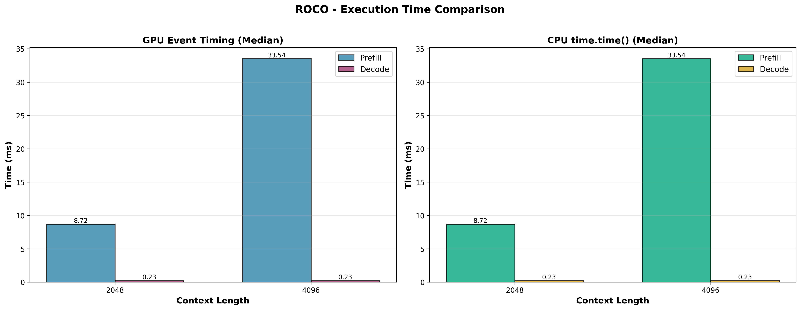
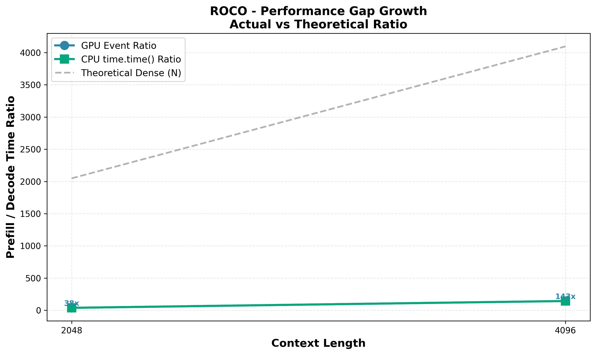
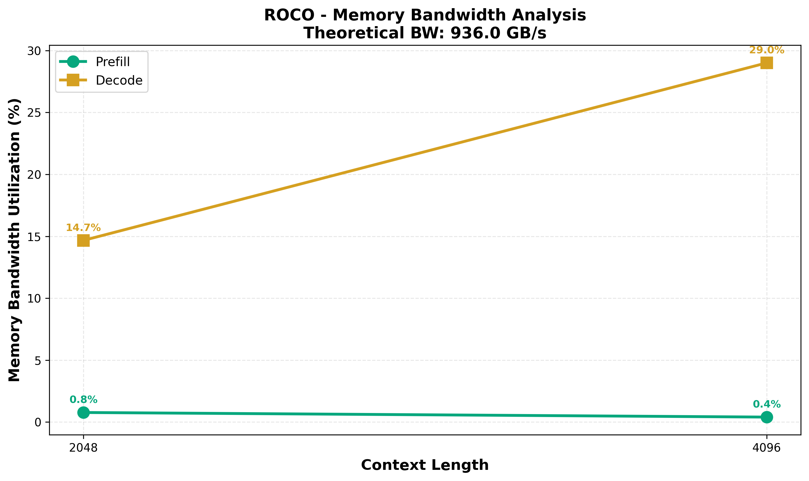
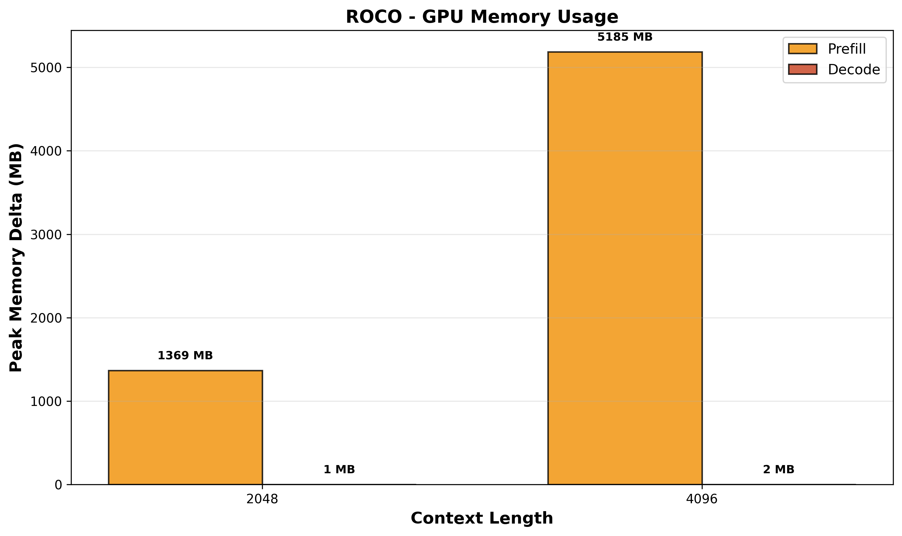
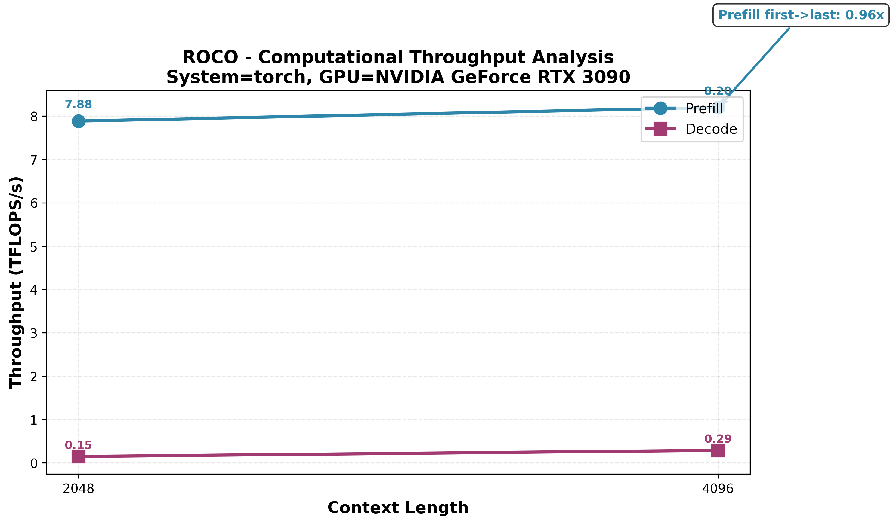
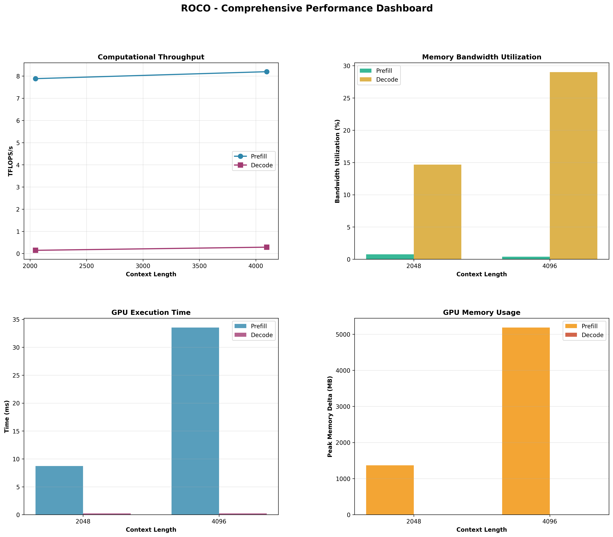
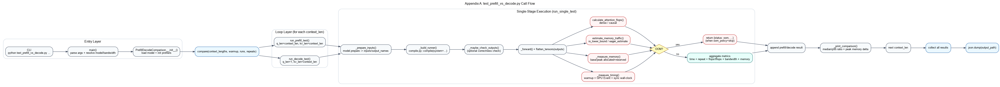

# Phase 1 Baseline Analysis (方法 - 结果 - 图表 - 讨论)

> 数据来源：`results/prefill_vs_decode_{h2o,attn,roco}_20260306_181022.json`  
> 平台：RTX 3090 24GB (`cuda:7`), CUDA 12.1, PyTorch 2.2.2+cu121

## 方法（含关键代码与具体计算/测算方式）

### 1. 实验设置

- 模型：`h2o`、`attn`、`roco`
- 阶段：`prefill(q_len=kv_len=N)` 与 `decode(q_len=1, kv_len=N)`
- 上下文：`N in {2048, 4096, 8192}`
- 计时：`warmup=10`, `runs=50`, `repeats=3`
- DType：`float16`
- OOM 策略：`skip`（记录 OOM 点并继续）

### 2. 关键代码路径（Phase1）

1. 输入构造：`model.prepare(batch_size, q_len, kv_len, dtype, device)`
2. 后端执行：`compile.py::compile(system='torch')`
3. 计时主口径：`torch.cuda.synchronize(device)` 包围 wall-clock（与 `asuka_exp.utils.perf` 对齐）
4. 统计：输出 `median/p95/CV/repeat_cv`
5. 流量与带宽：`io_lower_bound` 与 `eager_estimate` 两套口径

关键代码摘录（来自 `test_prefill_vs_decode.py`）：

```python
# 计时主口径：sync + wall-clock
self._synchronize()
tik = time.time()
_ = self._forward(f, inputs)
self._synchronize()
tok = time.time()
cur_cpu.append((tok - tik) * 1000.0)

# TFLOPS 计算
def to_tflops(gflops: float, ms: float) -> float:
    return gflops / (ms / 1000.0) / 1000.0

# 带宽利用率计算
time_s = time_ms / 1000.0
achieved_gbs = traffic_gb / time_s
utilization = achieved_gbs / theoretical_bandwidth_gbs * 100
```

### 3. 具体计算方式（以 TFLOPS 为例）

Phase1 的 dense FLOPs 定义：

```text
dense_flops = 4 * B * H * q_len * kv_len * D
dense_gflops = dense_flops / 1e9
TFLOPS = dense_gflops / (median_ms / 1000) / 1000
```

示例（RoCo, Decode, `N=4096`）：

```text
B=1, H=32, q_len=1, kv_len=4096, D=128
dense_flops = 4*1*32*1*4096*128 = 67,108,864
dense_gflops = 0.067108864
median_ms = 0.2339
TFLOPS = 0.067108864 / 0.0002339 / 1000 = 0.2869
```

与结果文件一致（`gpu_tflops_per_sec = 0.2869`）。

### 4. 具体计算方式（以带宽利用率为例）

```text
achieved_gbs = memory_traffic_gb / (median_ms / 1000)
util_percent = achieved_gbs / theoretical_bandwidth_gbs * 100
```

其中 `theoretical_bandwidth_gbs=936`（RTX 3090）。

## 结果

### 1. 时间与比例（主口径 median）

| Model | Prefill@2048 (ms) | Decode@2048 (ms) | Ratio@2048 | Prefill@4096 (ms) | Decode@4096 (ms) | Ratio@4096 | Prefill@8192 |
|---|---:|---:|---:|---:|---:|---:|---|
| attn | 6.3012 | 0.1874 | 33.62x | 23.8736 | 0.2087 | 114.37x | OOM |
| h2o  | 6.8926 | 0.2031 | 33.93x | 26.2365 | 0.2133 | 123.02x | OOM |
| roco | 8.7168 | 0.2313 | 37.69x | 33.5368 | 0.2339 | 143.39x | OOM |

### 2. Decode 带宽趋势（BW lower）

| Model | BW@2048 | BW@4096 | BW@8192 |
|---|---:|---:|---:|
| attn | 17.82% | 32.00% | 52.40% |
| h2o  | 16.57% | 31.56% | 45.09% |
| roco | 14.67% | 29.00% | 49.56% |

### 3. 显存峰值增量（MB）

| Model | Prefill@2048 | Prefill@4096 | Decode@2048 | Decode@4096 | Decode@8192 |
|---|---:|---:|---:|---:|---:|
| attn | 1288.00 | 5152.00 | 0.63 | 1.26 | 2.52 |
| h2o  | 1288.00 | 5152.00 | 0.64 | 1.27 | 2.52 |
| roco | 1368.50 | 5185.00 | 1.14 | 2.27 | 4.52 |

## 图表

以下给出“逐图说明”示例。论文正文建议以 RoCo 图作为主图（其趋势最清晰），其余模型作为补充附图。

### 图1：执行时间对比（RoCo）



1. 实验内容与方法  
   - 对 `N={2048,4096,8192}` 分别测量 Prefill/Decode 的 median 时间。  
   - 计时口径使用 `sync + wall-clock`（主口径），每点 `10 warmup + 50 runs + 3 repeats`。  
2. 结果与分析  
   - Prefill: `8.7168ms -> 33.5368ms`（`2048->4096` 约 `3.85x`）。  
   - Decode: `0.2313ms -> 0.2339ms -> 0.2737ms`，增长显著更慢。  
   - Prefill 在 `8192` OOM。  
3. 讨论  
   - Prefill 增长速度远高于 Decode，符合 attention 在 prefill 下更高复杂度特征。  
   - Decode 单步时延较小，但整体生成时延会随步数累计。  

### 图2：Prefill/Decode 时间比（RoCo）



1. 实验内容与方法  
   - 计算 `ratio = prefill_median / decode_median`。  
   - 同时绘制理论 dense 比率曲线（`~N`）作参考。  
2. 结果与分析  
   - `N=2048` 时比值约 `37.69x`；`N=4096` 时约 `143.39x`。  
   - 比值随 N 快速上升，显示两阶段扩展性差异显著。  
3. 讨论  
   - 该图直接支撑“Prefill 是长上下文主要时延来源”。  
   - `N=8192` 的比值缺失源于 Prefill OOM，属于硬件容量边界而非统计缺失。  

### 图3：带宽利用率趋势（RoCo）



1. 实验内容与方法  
   - 使用 `io_lower_bound` 流量口径估算 `BW(lower)%`。  
   - 公式：`util% = traffic_gb / time_s / 936 * 100`。  
2. 结果与分析  
   - Decode 带宽利用率由 `14.67%`（2048）升至 `49.56%`（8192）。  
   - Prefill 带宽利用率较低（`0.77%` 到 `0.40%`）。  
3. 讨论  
   - Decode 随上下文增长明显趋于 memory-bound。  
   - Prefill 在本口径下带宽占比低，说明瓶颈不只是“纯带宽”，还受到大中间张量与容量压力影响。  

### 图4：显存峰值增量（RoCo）



1. 实验内容与方法  
   - 统计 `peak_allocated_delta_mb = peak_alloc - base_alloc`。  
   - 在相同 device 上执行单次 forward 后读取 peak。  
2. 结果与分析  
   - Prefill: `1368.50MB`（2048）到 `5185.00MB`（4096），增量明显。  
   - Decode: `1.14MB`（2048）到 `4.52MB`（8192），仅 MB 级。  
3. 讨论  
   - 该图直接解释了 `8192 Prefill OOM` 的根本原因：激活/中间张量占用随 N 快速上升。  
   - Decode 显存增量小，主要压力不在容量，而在访存吞吐。  

### 图5：TFLOPS 趋势（RoCo）



1. 实验内容与方法  
   - 使用 dense FLOPs 口径计算 `TFLOPS = dense_gflops / time_s / 1000`。  
   - 与时间图互相校验计算效率变化。  
2. 结果与分析  
   - Prefill 在 `N=2048/4096` 约 `7.88~8.20 TFLOPS`。  
   - Decode 从 `0.1451` 提升到 `0.4904 TFLOPS`，但绝对值仍远低于 Prefill。  
3. 讨论  
   - Decode TFLOPS 低并不代表“实现错误”，而是其工作集与算术强度天然更低。  
   - 该图和带宽图联合表明：Decode 优化重点应放在访存与融合，而非仅追求算力峰值。  

### 图6：综合仪表盘（RoCo）



1. 实验内容与方法  
   - 将时间、TFLOPS、带宽、显存 4 个维度合并展示。  
   - 用于快速检查结论是否一致、是否有单指标误导。  
2. 结果与分析  
   - 时间维度：Prefill 快速增长且 `8192` OOM。  
   - 带宽维度：Decode 随 N 上升最明显。  
   - 显存维度：Prefill 增量远大于 Decode。  
3. 讨论  
   - 该图可作为论文总览图：一图同时支持“Prefill 容量/复杂度瓶颈 + Decode 带宽瓶颈”。  
   - 建议正文主放 dashboard，子图放 execution time 与 bandwidth trend，形成“现象-机制”闭环。  

## 讨论

### 1. 主要结论

1. Prefill 在 `2048->4096` 近似 `~4x` 增长，符合 attention 主项二次增长特征。  
2. Decode 增长显著更慢，但带宽利用率随 N 明显升高，呈现更强 memory-bound 特征。  
3. `8192` 上三种模型的 Prefill 全部 OOM，给出了 24GB 显存下的容量边界。  

### 2. 稳定性与异常点

1. 大多数点 `CV < 0.05`。  
2. `h2o prefill@4096` 的 wall-clock `CV=5.5843` 为异常值，但该点 `GPU Event CV=0.0031`、`repeat_cv=0.0013`，更像单次系统抖动造成；结论应优先使用 `median/p95`。  

### 3. 局限与下一步

1. 本阶段仅 `torch` 后端、单卡 3090，且属于 kernel 级实验。  
2. `8192` Prefill 缺失有效点，后续可在更大显存卡补齐。  
3. 下一阶段可将该结论作为 decode 图分析和 fused-kernel 设计的 baseline 依据。  

## 附录A：调用流程链（对应 `test_prefill_vs_decode.py`）



流程图源文件：`plots/appendix_a_call_flow.dot`（可用 `dot -Tpng/-Tsvg` 重新导出）。

说明：

1. 主流程是“每个 `context_len` 下，固定跑一对 `prefill + decode`”。
2. 指标链路固定为：时间 -> 显存 -> 流量 -> FLOPs -> 派生 TFLOPS/带宽利用率。
3. `oom_policy=skip` 时，单点 OOM 不中断整组实验。

## 附录B：关键统计口径与计算方式

### B.1 时间口径

| 口径 | 代码实现 | 计算方式 | 输出字段（示例） |
|---|---|---|---|
| 主口径（sync + wall-clock） | `tik=time.time(); forward; tok=time.time()`，前后 `torch.cuda.synchronize()` | `time_ms = (tok - tik) * 1000` | `gpu_median_time_ms`, `gpu_p95_time_ms`, `gpu_cv` |
| 次口径（GPU Event） | `start_evt.record(); forward; end_evt.record()` | `elapsed_ms = start_evt.elapsed_time(end_evt)` | `gpu_event_median_time_ms`, `gpu_event_p95_time_ms`, `gpu_event_cv` |
| 稳健统计 | `summarize_times_ms` | `avg/min/max/std/median/p05/p10/p90/p95/p99/cv`，其中 `cv=std/avg` | `*_avg_time_ms`, `*_median_time_ms`, `*_p95_time_ms`, `*_cv` |
| repeat 间稳定性 | 对每个 repeat 先求 mean，再对 mean 序列做统计 | `repeat_cv = std(repeat_means)/mean(repeat_means)` | `repeat_gpu_cv`, `repeat_cpu_cv` |

注：历史字段命名沿用 `gpu_*`，但主口径数值来自 `sync + wall-clock`（与 `asuka_exp.utils.perf` 对齐）。

### B.2 FLOPs / TFLOPS 口径

设 `B=batch_size, H=head_num, Q=q_len, K=kv_len, D=head_dim`。

| 口径 | 公式 | 字段 |
|---|---|---|
| dense pairs | `dense_pairs = Q * K` | `flops_dense_pairs` |
| causal valid pairs | `valid_pairs = Q*K - Q*(Q-1)/2` | `flops_causal_valid_pairs` |
| dense FLOPs | `dense_flops = 4 * B * H * dense_pairs * D` | `flops_dense_gflops`（/1e9） |
| causal FLOPs | `causal_flops = 4 * B * H * valid_pairs * D` | `flops_causal_gflops`（/1e9） |
| TFLOPS | `tflops = gflops / (time_ms/1000) / 1000` | `gpu_tflops_per_sec`, `gpu_tflops_per_sec_causal` |

### B.3 流量 / 带宽口径

| 口径 | 公式 | 字段 |
|---|---|---|
| tensor 字节数 | `nbytes(t)=t.numel()*t.element_size()` | - |
| IO 下界流量 | `io_lower_bound_bytes = input_read_bytes + output_write_bytes` | `memory_traffic_gb` |
| eager 估算流量 | `eager_estimate_bytes = io_lower_bound + scores_rw + probs_rw + mask_rw` | `memory_traffic_eager_estimate_gb` |
| 中间张量估算 | `scores_rw=2*(B*H*Q*K*bytes_per_qk)`；`probs_rw=2*(B*H*Q*K*4)`；`mask_rw=2*(Q*K*bytes_per_qk)` | `memory_breakdown.*` |
| 实际带宽 | `achieved_gbs = traffic_gb / (time_ms/1000)` | `achieved_bandwidth_gbs` |
| 带宽利用率 | `util% = achieved_gbs / theoretical_bandwidth_gbs * 100` | `bandwidth_utilization_percent` |

补充：

1. `bandwidth_utilization_percent` 使用 `io_lower_bound + median` 作为默认展示口径。
2. 同时提供 `bandwidth_lower_bound_avg_util_percent` 与 `bandwidth_eager_estimate_util_percent` 作为对照。

### B.4 显存口径

| 口径 | 计算方式 | 字段 |
|---|---|---|
| base 显存 | forward 前读取 `memory_allocated/memory_reserved` | `base_memory_allocated_mb`, `base_memory_reserved_mb` |
| peak 显存 | `reset_peak_memory_stats` 后跑一次 forward，再读取 `max_memory_*` | `peak_memory_mb`, `peak_memory_reserved_mb` |
| peak 增量 | `peak_delta = max(0, peak - base)` | `peak_memory_delta_mb`, `peak_memory_reserved_delta_mb` |

### B.5 阶段对比口径（Prefill vs Decode）

| 指标 | 公式 | 作用 |
|---|---|---|
| 时间比（median） | `ratio_median = prefill_median / decode_median` | 衡量两阶段扩展差异 |
| 时间比（p95） | `ratio_p95 = prefill_p95 / decode_p95` | 衡量尾延迟差异 |
| 峰值显存增量对比 | `prefill_peak_delta vs decode_peak_delta` | 区分容量压力与带宽压力 |
